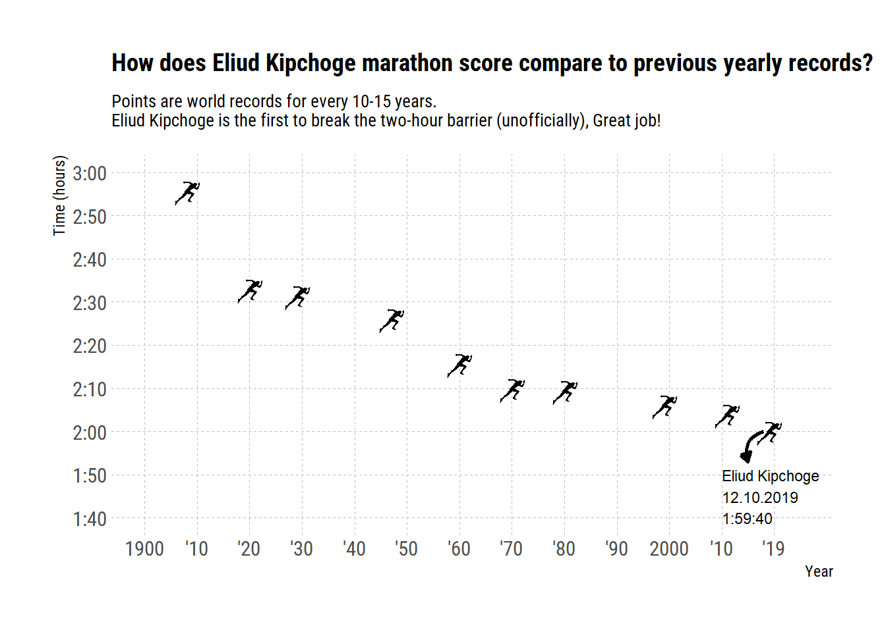

# Visualizing Eliud Kipchoge INEOS new marathon record in Viena, Austria
---
---

```{r setup, include=FALSE}
knitr::opts_chunk$set(echo = TRUE)
```

# Background

On saturday October 12, 2019, Eliud Kipchoge broke the two-hour marathon barrier 
I saw Neil Saunders’ Twitter post visualizing the new record and wanted to try and reproduce it with runners instead of points. We will obtain the data from a Wikipedia page with {rvest}, wrangle and tidy it and eventually plot it using {ggimage}.
Loading the packages needed:

```{r, warning=FALSE}
library(tidyverse)
library(rvest)
library(janitor)
library(lubridate)
library(ggimage)
library(hrbrthemes)
```
We’ll use {tidyverse} for tidy manipulation and plotting, {janitor} for cleaning the column names, {lubridate} for working with dates, {ggimage} for a plot with images and {hrbrthemes} for a nice quick aesthetic theme.

## Retrieving data from wikipedia
In order to view the new record in comparison to other world records, We’ll turn to Wikipedia and see what we can find there. We only want the table with men’s records, so let’s get that:

```{r}
#Retrieving data from wikipedia
wiki_url<-"https://en.wikipedia.org/wiki/Marathon_world_record_progression"
runners_wiki<-wiki_url %>% 
  read_html() %>%
  html_nodes(xpath = '//*[@id="mw-content-text"]/div/table[1]') %>%
  html_table(fill = TRUE) %>%
  as.data.frame()
```

Using the {rvest} package we are able to scrape the Wikipedia page for the table we wanted.
## Wrangling the Data
Let’s look at our table to see what we have and what we’ll need to do:
```{r}
head(runners_wiki, n=3)
```
A little messey but that’s OK. What we’ll need to visualize Eliud Kipchoge’s record is the Name, Time and Date of all runners. We’ll start with cleaning our data:
```{r}
runners_clean<-runners_wiki %>%
  clean_names() %>%
  select(1,2,4)
```
The clean_names function cleans the column names making them easier to use.
```{r}
str(runners_clean)
```
looking at the variables structure to see if we
they need any manipulations. Yes, it seems both the
time and date are not recognized appropriately 
(In this case they’re characters) - let’s fix that:
```{r}
runners_mutate<-runners_clean %>%
  add_row(time = "1:59:40", name = "Eliud Kipchoge",
          date = "November 12, 2019") %>%
  mutate(run_period_raw =hms(time),
         run_duration = as.numeric(run_period_raw,"minutes"),
         run_year = year(mdy(date))) %>%
  select(c(-date, -time))
```
First I add Eliud Kipchoge’s new unofficial record 
as an observation into our dataframe. Then turn
to the {lubridate} package where I use the hms function to mutate the time variable we had into a new variable called ‘r_period_raw’. Although this cleans the variable, hms transforms it into a period object. What we need is to turn it into a numeric class which we did in our new variable ‘run_duration’. This will help us in plotting but I retained the period class variable as it makes it easier to read in this case.
```{r, warning=FALSE}
runners_mutate[5,4]<-1909
ggplot(runners_mutate, 
       aes(x = run_year, y = run_duration)) +
  geom_point()
```
Now we want to make it a little less crowded so we 
can easily insert an image of runners instead of points and not have it cluttered.
```{r}
runners_mutate %>% pull(run_year)

year_sub<-c(1908,1920,1929,1947, 
            seq(1960,1980, 10), 1999,2011,2019)

runners_mutate <- runners_mutate %>%
  filter(run_year %in% year_sub)
```

## Plot
```{r, warning=FALSE}
runners_mutate <- runners_mutate %>% 
  mutate(run_image = "run.png")

g<-ggplot(runners_mutate, aes(x=run_year, 
                              y=run_duration))+
  geom_image(aes(image = run_image), size = 0.05)+
  theme_ipsum_rc()
g
```

## Plot Aesthetics
```{r, warning=FALSE}
g1<-g+
  scale_x_continuous(name = "Year",
                          limits = c(1900,2025),
                          breaks = seq(1900,2020,10),
                          labels = c("1900", paste0("'", seq(10,90,10)),"2000", "'10","'19"))

g2<-g1 +
  scale_y_time(name = "Time (Hours)",
               limits = c(100,180),
               breaks = seq(100,180,10),
               labels = c("1:40","1:50","2:00",
                          "2:10","2:20","2:30",
                          "2:40","2:50","3:00"))

g3<-g2+
  labs(title = "Comparing Eliud Kipchoge marathon score to previous yearly records?",
       subtitle = "Points are world records for every 10-15 years. \nEliud Kipchoge is the first to break the two-hour barrier")+
  theme(panel.grid.minor = element_blank(),
        panel.grid.major = element_line(colour = "gray75", size = 0.1,
                                        linetype = "dashed"),
        plot.title = element_text(size = 10),
        plot.subtitle = element_text(size = 9))
g4<-g3+
  geom_curve(aes(x=2018,y=120,xend=2015,yend=113),
             colour = "black", size=0.9,
             curvature = 0.5,
             arrow = arrow(length = unit(2,"mm"),
             type="closed"))+
  annotate("text", x=2010, y=105, 
           label = "Eliud Kipchoge\n12.10.2019\n1:59:40",
           colour = "black",size=3,hjust=0)
g4

```


The record might have not been official but it is a fact that Eliud Kipchoge is indeed a G.O.A.T of marathon.

*__Francis Gichere__ is an upcoming data scientist with interest in data modeling, machine learning and Business Intelligence*


